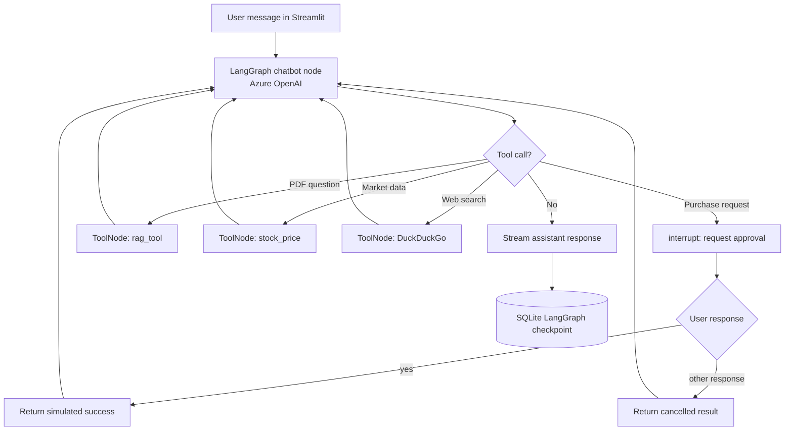

# Stateful LangGraph AI Agent with Agentic RAG and Human-in-the-Loop

A production-oriented conversational AI application built with **LangGraph**, **LangChain**, and **Streamlit**. It demonstrates a stateful ReAct-style tool cycle, SQLite-backed graph checkpoints, per-chat PDF retrieval, external information tools, streaming responses, and a Human-in-the-Loop (HITL) approval step for a **simulated** stock purchase workflow.

This project is an educational application and prototype. It does not place real stock orders or provide production financial services.

## Features

- **Stateful tool-using agent:** A LangGraph state machine sends messages to an Azure OpenAI chat model, routes tool calls through a `ToolNode`, and returns tool results to the model.
- **PDF question answering (RAG):** Upload a PDF through the Streamlit sidebar. PyMuPDF loads it, `RecursiveCharacterTextSplitter` divides it into overlapping chunks, and Azure OpenAI embeddings index the chunks in a FAISS vector store. Similarity retrieval returns up to four chunks for the agent to use.
- **Per-thread document context:** The backend associates each in-memory retriever with a chat thread ID, so the RAG tool can retrieve from that thread's uploaded document.
- **SQLite graph checkpointing:** LangGraph's `SqliteSaver` persists graph state and message history by thread ID. Chat titles are stored in a separate SQLite table.
- **Human approval step:** The `purchase_stock` tool pauses using LangGraph `interrupt()` and asks the user to approve or decline. The Streamlit UI resumes the graph with the user's response. An approval returns a simulated success result; it does not connect to a broker or execute a trade.
- **Information tools:** A stock-price lookup calls AlphaVantage's daily time-series endpoint, and a DuckDuckGo search tool supports web searches.
- **Streaming chat UI:** Streamlit renders chatbot response chunks as they arrive and provides controls for starting and reopening conversations.

## Architecture



### Request flow

1. Streamlit sends the message and the current `thread_id` to the compiled graph.
2. The chatbot node invokes the Azure OpenAI model with the conversation and available tools.
3. LangGraph routes tool calls to the tool node. Tool results return to the chatbot node, which can then produce a response.
4. For a stock purchase request, `purchase_stock` interrupts graph execution. The UI detects the pause and resumes it with the user's next chat input. The sample tool only returns a simulated result.
5. LangGraph checkpoints conversation state in SQLite. PDF retrievers, however, are held in a process-local Python dictionary and are not persisted with those checkpoints.

## Tech stack

| Area | Technologies in the supplied code |
|---|---|
| Language and UI | Python, Streamlit |
| Agent orchestration | LangGraph, LangChain Core |
| Chat model and embeddings | Azure OpenAI (`gpt-4.1-mini`, `text-embedding-3-small`) |
| PDF processing | PyMuPDF (`PyMuPDFLoader`), `RecursiveCharacterTextSplitter` |
| Vector retrieval | FAISS (`faiss-cpu`), similarity search |
| Checkpointing and titles | SQLite, LangGraph `SqliteSaver` |
| External tools | AlphaVantage REST API, DuckDuckGo Search |
| Configuration | `python-dotenv` |

## Project structure

```text
.
├── backend.py          # LangGraph graph, tools, PDF ingestion, SQLite checkpointing
├── frontend.py         # Streamlit interface, thread selection, uploads, streaming and HITL resume
├── requirements.txt    # Python dependencies (provide this file in the repository)
├── .env.example        # Environment variable template (provide this file in the repository)
└── README.md
```

The supplied code imports `backend` from `frontend.py`. Run the app from the project root so that this import and relative SQLite database path resolve as expected.

## Installation and setup

### 1. Get the project files

```bash
git clone https://github.com/SreeshanSree/Stateful-Multi-Threaded-AI-Agent-with-RAG-Long-Term-Memory-Human-in-the-Loop.git
cd Stateful-Multi-Threaded-AI-Agent-with-RAG-Long-Term-Memory-Human-in-the-Loop
```

### 2. Create a virtual environment

**Windows PowerShell**

```powershell
python -m venv .venv
.\.venv\Scripts\Activate.ps1
```

**macOS / Linux**

```bash
python3 -m venv .venv
source .venv/bin/activate
```

### 3. Install dependencies

```bash
pip install -r requirements.txt
```

The uploaded materials did not include `requirements.txt`; make sure the repository contains a dependency file for the imports used by `backend.py` and `frontend.py` before following this step.

### 4. Configure credentials

Create a `.env` file in the project root. The backend loads environment variables with `python-dotenv` and expects Azure OpenAI configuration plus the API key used by the AlphaVantage request:

```ini
AZURE_OPENAI_API_KEY=your_azure_openai_api_key
AZURE_OPENAI_ENDPOINT=https://your-resource-name.openai.azure.com/
OPENAI_API_VERSION=your_supported_api_version
AZURE_OPENAI_DEPLOYMENT_NAME=your_chat_model_deployment
INFOWAY_API_KEY=your_alphavantage_api_key
```

`INFOWAY_API_KEY` is the environment variable name read in the supplied code, even though it is used as the AlphaVantage API key. Set it to the key for the AlphaVantage account you intend to use. The Azure deployment name and API version must match your Azure OpenAI resource configuration. Optional LangSmith tracing variables may be configured if tracing is set up in your environment.

### 5. Start the app

```bash
streamlit run frontend.py
```

Open the local URL printed by Streamlit, commonly `http://localhost:8501`.

## Usage examples

### Ask about an uploaded PDF

1. Use **Upload a PDF for this chat** in the sidebar.
2. Wait for indexing to finish.
3. Ask a question about the PDF in the chat.

The RAG tool retrieves relevant chunks from the uploaded document's in-memory FAISS index. Ask the agent a question such as: “Summarize the report's revenue discussion.”

### Look up a stock symbol

Ask for a stock price, such as “Check the latest daily data for AAPL.” The `stock_price` tool requests AlphaVantage's `TIME_SERIES_DAILY` data. Availability and freshness depend on the API plan and response.

### Try the approval flow

Ask to buy a quantity of a stock, for example: “Buy 10 shares of TSLA.” The graph pauses and displays an approval prompt. Reply `yes` to resume with an approval, or reply with another response to decline. This demonstrates an approval gate only; no order is sent to a broker and no financial transaction takes place.

### Continue a conversation

Use **New Chat** to start a new thread, or select a title under **Past conversation** to reopen a saved conversation. SQLite checkpointing preserves graph messages by thread ID. Automatically generated titles are stored in the `chat_titles` table.

## Security and production considerations

- **Protect secrets:** Keep `.env` out of source control. Do not commit API keys or other credentials.
- **Treat the stock flow as a demo:** The approval prompt does not validate price, funds, suitability, or broker-side execution. The success message is simulated and must not be represented as a completed trade.
- **Understand persistence boundaries:** SQLite persists graph checkpoints and chat titles. PDF vector indexes and their thread mapping are in process memory, so they are lost when the Python process restarts. They are not durable document storage.
- **Review thread isolation before multi-user use:** Thread IDs scope graph state and in-memory retrievers in this implementation, but authentication and authorization are not shown. This code alone does not establish secure multi-user access control.
- **Harden before deployment:** The supplied implementation does not demonstrate production-grade authentication, authorization, automated tests, observability, resilient retry handling, or scalable deployment. Add and validate these components for any real deployment.
- **Validate external data:** API responses and web search results can be unavailable, delayed, incomplete, or inaccurate. Handle errors and communicate source limitations before relying on them.

## Current scope

This repository demonstrates agent orchestration, tool use, basic PDF RAG, persistent graph checkpointing, streaming UI, and an approval interrupt. It should be described as a **production-oriented prototype** rather than an enterprise-grade or production-ready financial system.


